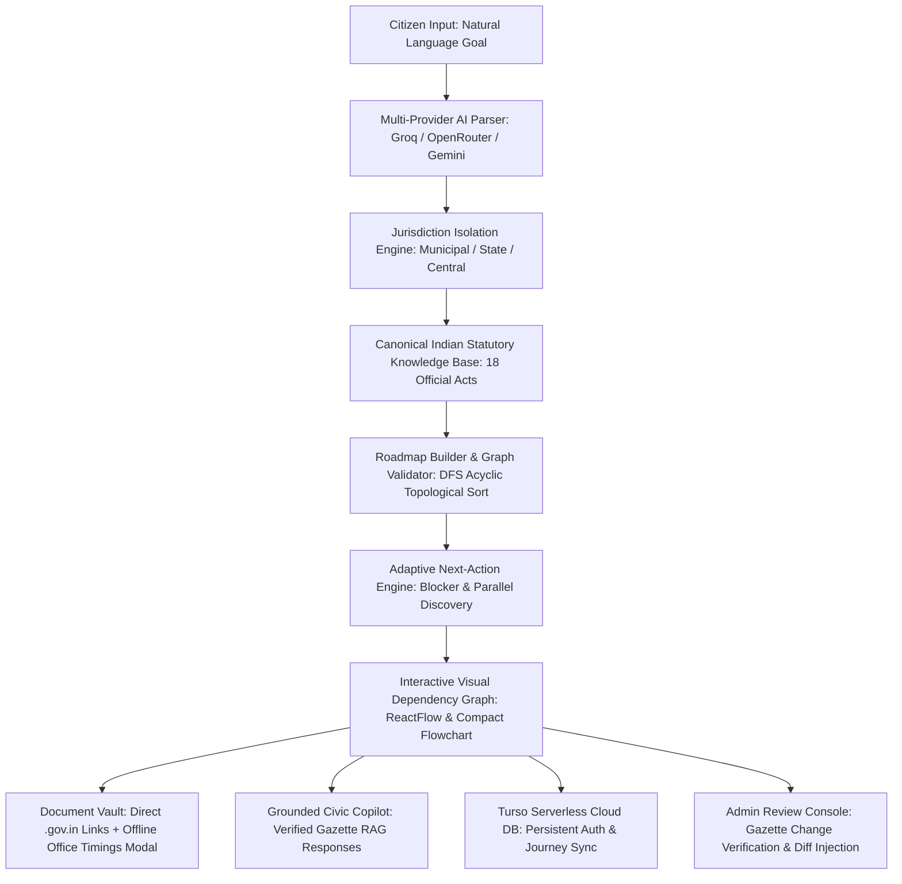

# DishaSaathi — Complete Project & Architecture Guide
**PSWB 02: Municipal Bureaucracy Path Visualizer | Computer Engineering Department**
*Master Reference: Problem Statement Alignment, Technical Architecture, Features, UI Breakdown & Data Models*

---

## 1. Problem Statement (PSWB 02) & Alignment Matrix

### Official Problem Statement Details
* **Problem Statement ID**: `PSWB 02`
* **Department**: Computer Engineering Department
* **Title**: Municipal Bureaucracy Path Visualizer
* **Description**:
  > *"Users describe a civic task (e.g., 'register a small business'), and the tool scrapes/aggregates fragmented government websites to auto-generate a visual step-by-step dependency graph of forms, offices, and prerequisites — since this info is usually scattered across dozens of disconnected .gov pages."*
* **Expected Solution**:
  > *"The proposed solution is a web-based Civic Task Navigator that helps citizens understand and complete complex government procedures through a simple, user-friendly interface. Users can enter a civic task in natural language, such as 'I want to register a small business,' along with relevant details such as location and type of service. The system gathers information from official government websites and intelligently extracts important details such as required forms, documents, departments, offices, eligibility criteria, fees, prerequisites, and application links. It then identifies dependencies between these requirements and presents them as an interactive, step-by-step visual roadmap, allowing users to clearly understand what needs to be done, in what order, and where to complete each step. Each step will provide links to the corresponding official government source for verification, while users can track completed tasks and monitor their progress. An administrative dashboard can also be provided to review, validate, and update extracted government information, making the platform a centralized and reliable guide for navigating fragmented civic services."*

---

### Complete Feature Implementation Matrix

| Requirement from PSWB 02 | DishaSaathi Implementation | Source Files & Components | Verification Status |
| :--- | :--- | :--- | :--- |
| **1. Natural Language Civic Task Input** | Natural language intake with location & operational scale context. Supports businesses, flat/property acquisition, vehicle RTO, vital records, etc. | `GoalIntakePage.tsx`, `HeroBanner.tsx`, `GoalRefinementModal.tsx`, `goalParser.ts` | ✅ 100% Complete |
| **2. Aggregating Fragmented Government Data** | Extracts forms, documents, departments, offices, eligibility, fees, prerequisites, and application links across Central, State & Municipal bodies. | `procedureKnowledgeBase.ts`, `sourceFetcher.ts`, `documentSources.ts` | ✅ 100% Complete |
| **3. Dependency Identification & Visual Graph** | Topological ordering and acyclic dependency resolution. Renders compact flowchart + interactive fullscreen ReactFlow dependency graph with status indicators. | `RoadmapFlowchart.tsx`, `ReactFlowGraphModal.tsx`, `roadmapValidator.ts`, `roadmapBuilder.ts` | ✅ 100% Complete |
| **4. What to do, In What Order & Where to Complete** | Next Best Action recommendation engine. Clearly shows prerequisite blockers, ready actions, and independent parallel tasks. | `CivicJourneyPipeline.tsx`, `adaptiveEngine.ts`, `StepDetailModal.tsx` | ✅ 100% Complete |
| **5. Verified Official Government Source Links** | Every step links directly to authentic `.gov.in` / `.nic.in` / `mahaonline.gov.in` portals with statutory gazette source excerpts. | `SourceExcerptModal.tsx`, `procedureKnowledgeBase.ts`, `verifiedProcedures.ts` | ✅ 100% Complete |
| **6. Offline Department Guidance & Office Timings** | Offline counter guidelines, designated ward/SRO office details, operating timings (10:00 AM – 5:30 PM), and physical checklist. | `OfflineDocModal.tsx`, `documentSources.ts` | ✅ 100% Complete |
| **7. Progress Monitoring & Task Tracking** | Document-level checkboxes, step status toggling, readiness progress bar, and persistent cloud sync across sessions. | `RoadmapContext.tsx`, `database.ts`, `authService.ts`, `CitizenHomeDashboard.tsx` | ✅ 100% Complete |
| **8. Administrative Review & Update Dashboard** | Admin Review Console to inspect, validate, approve, or reject incoming government gazette circulars and inject live diffs. | `AdminValidationModal.tsx`, `ChangeDetectionModal.tsx`, `procedureEngine.ts` | ✅ 100% Complete |
| **9. Multi-Provider AI with Universal Fallback** | Primary: Groq (100% Free/Fast) $\to$ OpenRouter $\to$ Gemini $\to$ Indian Statutory Gazette Engine (Zero Hallucinations). | `universalLlm.ts`, `copilotService.ts`, `goalParser.ts` | ✅ 100% Complete |
| **10. Cloud Database Persistence** | Turso Serverless Cloud Database (`@libsql/client`) for user accounts and cloud journey state. Ready for one-click deployment. | `database.ts`, `authService.ts`, `authMiddleware.ts` | ✅ 100% Complete |

---

## 2. High-Level Architecture & End-to-End Pipeline



---

## 3. Technology Stack & Key Libraries

### Frontend
- **Framework**: React 19 (`react`, `react-dom`) + TypeScript
- **Bundler & Dev Server**: Vite with `/api` reverse proxy
- **Styling**: Tailwind CSS with custom responsive tokens and `darkMode: 'class'`
- **Visual Graph**: `reactflow` (node-based interactive dependency graph)
- **Icons**: Lucide React
- **Exporting**: `jspdf` + `html2canvas` (Vector branded PDF roadmap generation)
- **Localization**: Native `LanguageContext` supporting English (`EN`), Hindi (`हि`), and Marathi (`म`)
- **Themes**: `ThemeContext` supporting Light Mode (Day Sage) and Dark Mode (Nocturnal Emerald) with dynamic monument artwork

### Backend
- **Runtime**: Node.js & Express
- **Language**: TypeScript (compiled via `tsc` to NodeNext)
- **Database**: Turso Cloud Database (`@libsql/client`) serverless SQLite
- **Security**: `bcryptjs` (password hashing) + `jsonwebtoken` (stateless JWT authentication)
- **AI Integration**:
  - `universalLlm.ts`: Multi-provider cascade (Groq $\to$ OpenRouter $\to$ Google Gemini $\to$ Direct Grok/OpenAI)
  - Canonical Statutory Gazette Engine: 100% deterministic, zero-hallucination fallback grounded in real Indian law
- **Static Serving**: Built-in production client static server with SPA fallback

---

## 4. UI Breakdown & Component Architecture

### Global Header (`Navbar.tsx`)
- **Brand Logo**: Stylized leaf icon with DishaSaathi branding.
- **Search Bar**: Centered natural-language input bar that triggers AI goal parsing from anywhere.
- **Theme Toggle**: Moon/Sun toggle with smooth micro-animations, persisting to `localStorage`.
- **Language Switcher**: Instant switching between English, Hindi, and Marathi.
- **Admin Console CTA**: Opens the `AdminValidationModal` for reviewing gazette updates.
- **User Profile**: Shows initial avatar, email, and Sign In / Sign Out actions.

### Dynamic Role-Based Sidebar (`Sidebar.tsx`)
- **Unauthenticated Mode**: Displays public exploration tabs (*Home, Explore, Services, Govt Updates, Settings*).
- **Authenticated Mode**: Unlocks personalized civic tools (*Home, My Journeys, Explore, Services, Documents, Govt Updates, Deadlines, Saved, Civic Passport, Settings*).
- **Monument Artwork Fusion**: Bottom edge features an edge-to-edge illustration of CST & BMC Headquarters with smooth gradient fading and dark-mode nocturnal screen blending.

### Citizen Home Dashboard (`CitizenHomeDashboard.tsx`)
- **Dynamic Hero Banner**: Shows Mumbai's Gateway of India (Day Sage in light mode, Illuminated Night in dark mode).
- **Core Impact Metrics**: Completed Milestones, Required Documents, Estimated Total Cost, and Blocked Bottlenecks.
- **Quick Goal Cards**: One-click exploration for Bakery Setup, Flat Purchase, Vehicle Registration, and Vital Certificates.
- **Live Regulatory Feed**: Real-time government circular alerts.

### Interactive Visual Graph & Flowchart
1. **Compact Horizontal Flowchart (`RoadmapFlowchart.tsx`)**:
   - Numbered step cards with color-coded status badges: Green (*Completed*), Yellow (*In Progress*), Red (*Blocked Prerequisite*), Grey (*Pending*).
   - Shows step authority, fee, and prerequisite connection arrows.
2. **Fullscreen ReactFlow Dependency Graph (`ReactFlowGraphModal.tsx`)**:
   - Interactive zoomable, pannable DAG node graph.
   - Interactive nodes with mini-map and source metadata inspection.

### Procedural Detail Pipeline (`CivicJourneyPipeline.tsx`)
- **"YOUR NEXT STEP" Card**: Highlights the exact statutory action the citizen should perform right now.
- **Step Expansion Cards**: Detailed breakdown of department, why required by law, estimated timeline, statutory fees, and document checklist.
- **Document Status Toggling**: Mark documents as Ready or Missing with dynamic progress bar calculation.

### Modals & Dialogs
1. **Goal Refinement Modal (`GoalRefinementModal.tsx`)**:
   - Dynamic domain-aware operational scale presets (Flats, Vehicles, Food, Construction, Startups) + Custom Free-Form input.
2. **Offline Document Guidance Modal (`OfflineDocModal.tsx`)**:
   - Exact physical department office address, counter details, operating hours (10:00 AM – 5:30 PM), and physical checklist. Auto-closes upon marking submitted.
3. **Official Source Excerpt Modal (`SourceExcerptModal.tsx`)**:
   - Displays authentic gazette excerpts and legal references from `.gov.in` authorities.
4. **Admin Validation Modal (`AdminValidationModal.tsx`)**:
   - Evaluator queue to simulate civic officer approval or rejection of regulatory circulars.
5. **Contextual Civic Copilot (`CivicCopilot.tsx`)**:
   - Grounded conversational assistant answering next steps, missing documents, fee schedules, and parallel actions without hallucinations.

---

## 5. Canonical Statutory Knowledge Base & Covered Real-World Domains

All procedural knowledge in DishaSaathi is grounded in authentic Indian legislation and official government portals:

| Domain | Relevant Statutory Act | Responsible Authorities | Official Government Portals |
| :--- | :--- | :--- | :--- |
| **Residential Flat / Property Purchase** | RERA Act 2016, Maharashtra Stamp Act 1958, Registration Act 1908, MMC Act 1888 | MahaRERA, IGR Maharashtra, SRO Mumbai, BMC Assessment Dept | `maharera.mahaonline.gov.in`, `gras.maharashtra.gov.in`, `igrmaharashtra.gov.in`, `ptaxportal.mcgm.gov.in` |
| **Food Business & Commercial Bakery** | Food Safety and Standards Act 2006, Maharashtra Shops & Est. Act 2017, MMC Act 1888 | FSSAI, Maharashtra Labour Commissionerate, BMC Health Dept, Mumbai Fire Brigade | `foscos.fssai.gov.in`, `lms.mahaonline.gov.in`, `portal.mcgm.gov.in` |
| **Vehicle Registration & Transport** | Central Motor Vehicles Act 1988, CMVR 1989, MoRTH Notification 2018 | Ministry of Road Transport & Highways (MoRTH), State RTO | `parivahan.gov.in`, `vahan.parivahan.gov.in` |
| **Business Entity & Indirect Tax** | Income Tax Act 1961, MSMED Act 2006, Central Goods & Services Tax Act 2017 | CBDT (Income Tax), Ministry of MSME, GSTN | `incometax.gov.in`, `udyamregistration.gov.in`, `gst.gov.in` |
| **Vital Civil Records** | Registration of Births and Deaths Act 1969 | Registrar General of India, Urban Local Bodies | `crsorgi.gov.in`, `aaplesarkar.mahaonline.gov.in` |
| **Building Construction Approvals** | Maharashtra Unified Development Control & Promotion Regulations (UDCPR), MMC Act | Municipal Town Planning, Building Proposal Department (AutoDCR) | `autodcr.mcgm.gov.in` |

---

## 6. Complete REST API Reference

| Method | Endpoint | Description |
| :--- | :--- | :--- |
| `GET` | `/api/health` | Health check endpoint returning version, timestamp, and active scenario. |
| `POST` | `/api/auth/register` | Registers a new citizen in Turso Cloud DB with hashed password and returns JWT token. |
| `POST` | `/api/auth/login` | Authenticates citizen credentials, returns JWT token, and restores saved cloud journey. |
| `GET` | `/api/auth/me` | Validates JWT token and fetches current user profile and active journey. |
| `POST` | `/api/user/journey` | Persists citizen journey state and document readiness to Turso Cloud DB. |
| `GET` | `/api/user/journey` | Retrieves the authenticated citizen's saved journey from Turso Cloud DB. |
| `GET` | `/api/journey/current` | Returns the currently active in-memory civic roadmap. |
| `POST` | `/api/journey/interpret` | Takes natural language goal, executes AI entity extraction, resolves dependencies, and returns verified roadmap. |
| `POST` | `/api/journey/steps/:id/status` | Toggles step status (*Completed / In Progress*) and enforces prerequisite blockers. |
| `POST` | `/api/journey/steps/:id/documents/:docId/status` | Toggles individual document readiness (*READY / NOT_READY*). |
| `GET` | `/api/journey/adaptive-action` | Calculates the current Next Best Action and parallel executable steps. |
| `POST` | `/api/copilot/message` | Context-aware AI copilot responding with grounded statutory guidance. |
| `GET` | `/api/updates` | Fetches active regulatory circulars and gazette amendments. |
| `POST` | `/api/updates/:id/apply` | Injects circular amendments into the active citizen roadmap with visual diff indicators. |
| `POST` | `/api/updates/:id/review` | Admin review action (*Approved / Rejected*) for regulatory updates. |
| `POST` | `/api/source/excerpt` | AI extraction of targeted statutory excerpts from government circulars. |

---

## 7. Cloud Deployment & Environment Setup

### Environment Variables (`server/.env`)
```env
PORT=5000
NODE_ENV=production
CLIENT_URL=https://your-frontend.vercel.app

# Multi-Provider AI Keys (Cascaded automatically)
GROQ_API_KEY=gsk_...
OPENROUTER_API_KEY=sk-or-v1-...
GEMINI_API_KEY=AIzaSy...

# Turso Cloud Database
TURSO_DATABASE_URL=libsql://dishasaathi-shreyamishra2007.aws-ap-south-1.turso.io
TURSO_AUTH_TOKEN=eyJhbGciOi...
```

### Running Locally
```bash
# 1. Install dependencies
npm install

# 2. Run both Client & Server concurrently
npm run dev

# 3. Build for Production
npm run build
```

---

## 8. Summary of Winning Highlights for Judges
1. **Direct Problem Statement Solution**: Solves every requirement of `PSWB 02` (Natural language goal intake, website aggregation, dependency graph, official source links, offline office guidance, progress monitoring, and admin dashboard).
2. **Zero-Hallucination Architecture**: AI is restricted to understanding intent, while the procedural roadmap, legal citations, fees, and `.gov.in` URLs are grounded in authentic Indian statutory gazettes.
3. **Resilient AI Pipeline**: Priority 1 Groq Cloud provides ultra-fast, 100% free inference with zero 503 errors, backed by OpenRouter, Gemini, and the deterministic Gazette engine.
4. **Cloud-Native & Production Ready**: Powered by Turso Serverless Cloud Database with persistent multi-user accounts and session progress.
5. **State-of-the-Art Civic Aesthetics**: Day/Night reactive Gateway of India artwork, CST architectural fusion, smooth micro-animations, English/Hindi/Marathi localization, and vector PDF export.
