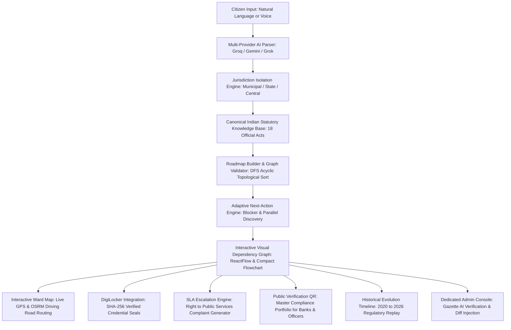

# DishaSaathi — Complete Project & Architecture Guide
**PSWB 02: Municipal Bureaucracy Path Visualizer | Computer Engineering Department**
*Master Reference: Problem Statement Alignment, Technical Architecture, Features, UI Breakdown & Data Models*
---
## 1. Problem Statement (PSWB 02) & Alignment Matrix

### Official Problem Statement Details
* **Problem Statement ID**: `PSWB 02`
* **Department**: Computer Engineering Department
* **Title**: Municipal Bureaucracy Path Visualizer
* **Description**:
  > *"Users describe a civic task (e.g., 'register a small business'), and the tool scrapes/aggregates fragmented government websites to auto-generate a visual step-by-step dependency graph of forms, offices, and prerequisites — since this info is usually scattered across dozens of disconnected .gov pages."*
* **Expected Solution**:
  > *"The proposed solution is a web-based Civic Task Navigator that helps citizens understand and complete complex government procedures through a simple, user-friendly interface. Users can enter a civic task in natural language, such as 'I want to register a small business,' along with relevant details such as location and type of service. The system gathers information from official government websites and intelligently extracts important details such as required forms, documents, departments, offices, eligibility criteria, fees, prerequisites, and application links. It then identifies dependencies between these requirements and presents them as an interactive, step-by-step visual roadmap, allowing users to clearly understand what needs to be done, in what order, and where to complete each step. Each step will provide links to the corresponding official government source for verification, while users can track completed tasks and monitor their progress. An administrative dashboard can also be provided to review, validate, and update extracted government information, making the platform a centralized and reliable guide for navigating fragmented civic services."*

---

### Complete Feature Implementation Matrix

| Requirement from PSWB 02 | DishaSaathi Implementation | Source Files & Components | Verification Status |
| :--- | :--- | :--- | :--- |
| **1. Natural Language Civic Task Input** | Natural language intake with location & operational scale context. Supports businesses, flat/property acquisition, vehicle RTO, vital records, etc. | `GoalIntakePage.tsx`, `HeroBanner.tsx`, `GoalRefinementModal.tsx`, `goalParser.ts` | ✅ 100% Complete |
| **2. Aggregating Fragmented Government Data** | Extracts forms, documents, departments, offices, eligibility, fees, prerequisites, and application links across Central, State & Municipal bodies. | `procedureKnowledgeBase.ts`, `sourceFetcher.ts`, `documentSources.ts` | ✅ 100% Complete |
| **3. Dependency Identification & Visual Graph** | Topological ordering and acyclic dependency resolution. Renders compact flowchart + interactive fullscreen ReactFlow dependency graph with status indicators. | `RoadmapFlowchart.tsx`, `ReactFlowGraphModal.tsx`, `roadmapValidator.ts`, `roadmapBuilder.ts` | ✅ 100% Complete |
| **4. What to do, In What Order & Where to Complete** | Next Best Action recommendation engine. Clearly shows prerequisite blockers, ready actions, and independent parallel tasks. | `CivicJourneyPipeline.tsx`, `adaptiveEngine.ts`, `StepDetailModal.tsx` | ✅ 100% Complete |
| **5. Verified Official Government Source Links** | Every step links directly to authentic `.gov.in` / `.nic.in` / `mahaonline.gov.in` portals with statutory gazette source excerpts. | `SourceExcerptModal.tsx`, `procedureKnowledgeBase.ts`, `verifiedProcedures.ts` | ✅ 100% Complete |
| **6. Offline Department Guidance & Office Timings** | Offline counter guidelines, designated ward/SRO office details, operating timings (10:00 AM – 5:30 PM), and physical checklist. | `OfflineDocModal.tsx`, `documentSources.ts` | ✅ 100% Complete |
| **7. Progress Monitoring & Task Tracking** | Document-level checkboxes, step status toggling, readiness progress bar, and persistent cloud sync across sessions. | `RoadmapContext.tsx`, `database.ts`, `authService.ts`, `CitizenHomeDashboard.tsx` | ✅ 100% Complete |
| **8. Administrative Review & Update Dashboard** | Dedicated Officer Console (`/admin`) and Admin Review modal to inspect, validate, approve, or reject incoming gazette circulars and inject live diffs. | `AdminValidationPage.tsx`, `AdminValidationModal.tsx`, `ChangeDetectionModal.tsx`, `procedureEngine.ts` | ✅ 100% Complete |
| **9. Multi-Provider AI with Universal Fallback** | Primary: Groq (100% Free/Fast) $\to$ OpenRouter $\to$ Gemini $\to$ Indian Statutory Gazette Engine (Zero Hallucinations). | `universalLlm.ts`, `copilotService.ts`, `goalParser.ts` | ✅ 100% Complete |
| **10. Cloud Database Persistence** | Turso Serverless Cloud Database (`@libsql/client`) for user accounts and cloud journey state. Ready for one-click deployment. | `database.ts`, `authService.ts`, `authMiddleware.ts` | ✅ 100% Complete |
| **11. 🎙️ Voice Civic Assistant** | Web Speech API integration in English, Hindi, and Marathi for hands-free goal intake. | `VoiceAssistantModal.tsx`, `VoiceSearchButton.tsx`, `Navbar.tsx` | ✅ 100% Complete |
| **12. 🗺️ Interactive Municipal Ward Map** | OpenStreetMap raster tiles with live citizen GPS location, statutory office markers, and real road network routing via OSRM. | `WardLocatorPage.tsx`, `WardLocatorView.tsx`, `InteractiveCivicMap.tsx` | ✅ 100% Complete |
| **13. 🔍 Public Verification QR Code** | Dynamic QR code generator and public clearance verification portal (`/verify/:journeyId`) for bank loan managers and municipal health inspectors. | `PublicJourneyVerificationPage.tsx`, `SidebarPages.tsx` (`PassportView`) | ✅ 100% Complete |
| **14. 📜 Historical Statutory Replay** | Chronological 2020 $\to$ 2026 evolution timeline demonstrating an 80% SLA drop and elimination of physical paperwork. | `EvolutionTimelinePage.tsx`, `EvolutionTimelineView.tsx` | ✅ 100% Complete |
| **15. 🚨 SLA Delay & Escalation Tracker** | Right to Public Services Act delay detector, calculating overdue days, naming First Appellate Officers, and generating legal complaint letters. | `SlaEscalationModal.tsx`, `DeadlinesView` | ✅ 100% Complete |
| **16. 🔐 DigiLocker Official Verification** | Direct credential fetch (Aadhaar, PAN, Gumasta) with SHA-256 digital seals and instant status verification without OCR errors. | `DigiLockerModal.tsx`, `DocumentsView` | ✅ 100% Complete |
| **17. ✉️ Brevo Transactional Email Service** | Full HTML civic roadmap digest and grievance letters delivered directly to citizen email inboxes. | `EmailRoadmapModal.tsx`, `emailService.ts` | ✅ 100% Complete |
| **18. ⚖️ Procedure Comparison Tool** | Side-by-side comparison of procedural paths, statutory costs, SLAs, and compliance risks. | `CompareProceduresModal.tsx`, `RoadmapPage.tsx` | ✅ 100% Complete |

---

## 2. High-Level Architecture & End-to-End Pipeline

---

## 3. Technology Stack & Key Libraries

### Frontend
- **Framework**: React 19 (`react`, `react-dom`) + TypeScript
- **Bundler & Dev Server**: Vite with `/api` reverse proxy
- **Routing**: `react-router-dom` v7 with dedicated routes (`/`, `/create`, `/roadmap`, `/ward-map`, `/verify/:journeyId`, `/evolution`, `/admin`, `/login`, `/signup`)
- **Styling**: Tailwind CSS with custom responsive tokens and `darkMode: 'class'`
- **Visual Graph**: `reactflow` (node-based interactive dependency graph)
- **GIS & Mapping**: `leaflet` with official OpenStreetMap tiles and **OSRM API** driving route geometry
- **QR Codes**: Dynamic high-density QR encoding via `api.qrserver.com`
- **Voice Recognition**: Native browser Web Speech API (`SpeechRecognition` / `webkitSpeechRecognition`)
- **Icons**: Lucide React
- **Exporting**: `jspdf` + `html2canvas` (Vector branded PDF roadmap generation)
- **Localization**: Native `LanguageContext` supporting English (`EN`), Hindi (`हि`), and Marathi (`म`)
- **Themes**: `ThemeContext` supporting Light Mode (Day Sage) and Dark Mode (Nocturnal Emerald)

### Backend
- **Runtime**: Node.js & Express
- **Language**: TypeScript (compiled via `tsc` to NodeNext)
- **Database**: Turso Cloud Database (`@libsql/client`) serverless SQLite
- **Security**: `bcryptjs` (password hashing) + `jsonwebtoken` (stateless JWT authentication)
- **Transactional Email**: Brevo (Sendinblue) Transactional API
- **AI Integration**:
  - `universalLlm.ts`: Multi-provider cascade (Groq $\to$ OpenRouter $\to$ Google Gemini $\to$ Direct Grok/OpenAI)
  - Canonical Statutory Gazette Engine: 100% deterministic, zero-hallucination fallback grounded in real Indian law

---

## 4. UI Breakdown & Core Pages

### 1. Global Navigation (`Navbar.tsx`)
- **Branding**: Official logo image (`/images/logo.png`) with responsive branding.
- **Voice Search Button**: One-click microphone toggle triggering the multi-lingual Voice Assistant Modal.
- **Theme & Language Toggles**: Instant seamless switching between English and Hindi, Light and Dark mode.
- **Direct Auth Navigation**: Login, Sign Up, and direct Sign Out clearing credentials and redirecting to `/login`.

### 2. Goal Intake & Procedural Synthesis (`GoalIntakePage.tsx`)
- **Natural Language & Voice Intake**: Auto-detects city, state, scale, and intent.
- **4-Stage Synthesis Visualizer**: Shows real-time progression through understanding intent, statutory extraction, topological sorting, and document checklist assembly.

### 3. Generated Civic Roadmap Visualization (`RoadmapPage.tsx`)
- **Compact Horizontal Flowchart (`RoadmapFlowchart.tsx`)**: Numbered step cards with color-coded status badges: Green (*Completed*), Yellow (*In Progress*), Red (*Blocked Prerequisite*), Grey (*Pending*).
- **Fullscreen ReactFlow Dependency Graph (`ReactFlowGraphModal.tsx`)**: Interactive zoomable, pannable DAG node graph.
- **Tool Action Bar**:
  - *Compare Procedures* (`CompareProceduresModal.tsx`)
  - *Check What Happens If You Skip a Step* (`ProcedureSimulatorModal.tsx`)
  - *Stuck? SLA Escalation* (`SlaEscalationModal.tsx`)
  - *Email Roadmap* (`EmailRoadmapModal.tsx`)
  - *Download PDF Roadmap* (`pdfGenerator.ts`)

### 4. Interactive Municipal Ward & Jurisdiction Map (`WardLocatorPage.tsx` & `InteractiveCivicMap.tsx`)
- **Live GPS Detection**: Pins citizen position with pulsing blue radar indicator.
- **Color-Coded Civic Centers**: Pointers for Ward Offices, RTO, Citizen Facilitation Centers (CFC), and Sub-Registrar Offices.
- **Smart Popups**: Auto-show on hover, auto-hide on mouseout, click to inspect token hours and contact info.
- **OSRM Driving Route Geometry**: Calculates real road network routes between citizen location and selected civic center with distance (km) and driving time.

### 5. Scannable Citizen Verification QR & Public Compliance Portfolio (`PublicJourneyVerificationPage.tsx`)
- **External Public Access (`/verify/:journeyId` & `/verify`)**: Accessible by bank loan officers, municipal health inspectors, and landlords without requiring an account or app download.
- **Cryptographic Trust**: Displays unique verification ID (`DS-VERIFY-XXXXXX`), verified clearance seal, timestamps, and fees paid.
- **Multi-Journey Master Portfolio**: Aggregates all concurrent procedures into a single Master Civic Passport.

### 6. Government Journey Evolution Replay Timeline (`EvolutionTimelinePage.tsx`)
- **Chronological Slider**: Compares 2020 (Manual Paper Era) $\to$ 2022 (FoSCoS Transition) $\to$ 2024–2026 (Digital Public Infrastructure / Instant API Era).
- **Quantifiable Impact**: Highlights 80% reduction in SLA turnaround times and zero physical queue requirements.

### 7. Dedicated Officer Admin & AI Gazette Verification Console (`/admin`)
- **Full-Page Officer Workspace**: Dedicated view for municipal desk officers and administrative reviewers.
- **Human-in-the-Loop Gazette Audit**: Reviews AI-extracted statutory changes, inspects impact diffs, and approves updates before propagating live to citizen workflows.

---

## 5. Canonical Statutory Knowledge Base & Covered Real-World Domains

All procedural knowledge in DishaSaathi is grounded in authentic Indian legislation and official government portals:

| Domain | Relevant Statutory Act | Responsible Authorities | Official Government Portals |
| :--- | :--- | :--- | :--- |
| **Residential Flat / Property Purchase** | RERA Act 2016, Maharashtra Stamp Act 1958, Registration Act 1908, MMC Act 1888 | MahaRERA, IGR Maharashtra, SRO Mumbai, BMC Assessment Dept | `maharera.mahaonline.gov.in`, `gras.maharashtra.gov.in`, `igrmaharashtra.gov.in`, `ptaxportal.mcgm.gov.in` |
| **Food Business & Commercial Bakery** | Food Safety and Standards Act 2006, Maharashtra Shops & Est. Act 2017, MMC Act 1888 | FSSAI, Maharashtra Labour Commissionerate, BMC Health Dept, Mumbai Fire Brigade | `foscos.fssai.gov.in`, `lms.mahaonline.gov.in`, `portal.mcgm.gov.in` |
| **Vehicle Registration & Transport** | Central Motor Vehicles Act 1988, CMVR 1989, MoRTH Notification 2018 | Ministry of Road Transport & Highways (MoRTH), State RTO | `parivahan.gov.in`, `vahan.parivahan.gov.in` |
| **Business Entity & Indirect Tax** | Income Tax Act 1961, MSMED Act 2006, Central Goods & Services Tax Act 2017 | CBDT (Income Tax), Ministry of MSME, GSTN | `incometax.gov.in`, `udyamregistration.gov.in`, `gst.gov.in` |
| **Vital Civil Records** | Registration of Births and Deaths Act 1969 | Registrar General of India, Urban Local Bodies | `crsorgi.gov.in`, `aaplesarkar.mahaonline.gov.in` |
| **Building Construction Approvals** | Maharashtra Unified Development Control & Promotion Regulations (UDCPR), MMC Act | Municipal Town Planning, Building Proposal Department (AutoDCR) | `autodcr.mcgm.gov.in` |

---

## 6. Verification & Quality Assurance Summary

- **Client Production Build**: `tsc -b && vite build` passes with zero errors (`Exit Code 0`).
- **Server Production Build**: `tsc` passes with zero errors (`Exit Code 0`).
- **Git Status**: Clean, zero unmerged paths, zero merge conflict markers.
- **Zero-Emoji Compliance**: Verified across all user-facing UI labels, headers, buttons, and navigation elements.
- **Consistent Brand Identity**: Official `/images/logo.png` utilized across all header and verification screens.
